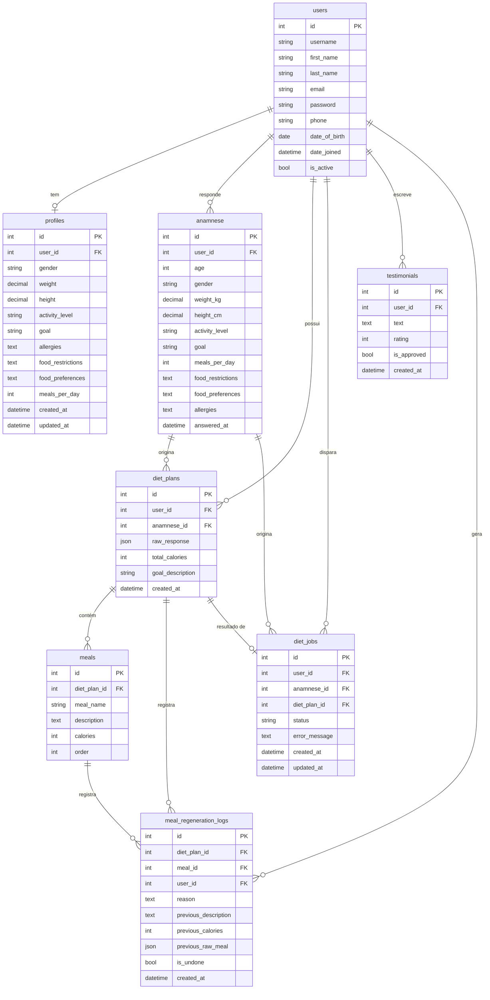

# Modelagem do Banco de Dados - MyNutri AI

## Visão Geral

O banco de dados é responsável por armazenar todas as informações da aplicação, incluindo dados dos usuários, respostas da anamnese, planos alimentares gerados e logs de regeneração.

- **Desenvolvimento:** SQLite (`db.sqlite3`)
- **Produção:** PostgreSQL (configurar via `DATABASE_URL` no `.env`)

### Diagrama de Entidade-Relacionamento (ERD)

---

## Tabela: users (CustomUser)

Estende `AbstractUser` do Django. Login é feito via **email** (não username).

| Campo | Tipo | Descrição |
|-------|------|-----------|
| `id` | int (PK) | ID auto-incremento |
| `username` | string | Gerado a partir do email |
| `first_name` | string | Primeiro nome |
| `last_name` | string | Sobrenome |
| `email` | string (unique) | Email — usado como login |
| `password` | string | Hash da senha (Django gerencia) |
| `phone` | string | Telefone (opcional) |
| `date_of_birth` | date | Data de nascimento (opcional) |
| `date_joined` | datetime | Data de criação da conta |
| `is_active` | bool | Conta ativa |

---

## Tabela: profiles (Profile)

Perfil nutricional do usuário (relação OneToOne com `CustomUser`). Criado automaticamente junto com o usuário.

| Campo | Tipo | Descrição |
|-------|------|-----------|
| `id` | int (PK) | ID auto-incremento |
| `user_id` | int (FK) | Referência ao `CustomUser` |
| `gender` | string | `M`, `F` ou `O` |
| `weight` | decimal(5,2) | Peso em kg (opcional) |
| `height` | decimal(5,2) | Altura em cm (opcional) |
| `activity_level` | string | `sedentary`, `light`, `moderate`, `intense`, `athlete` |
| `goal` | string | `lose`, `maintain`, `gain` |
| `allergies` | text | Alergias alimentares |
| `food_restrictions` | text | Restrições alimentares |
| `food_preferences` | text | Preferências alimentares |
| `meals_per_day` | int | Quantidade de refeições por dia (padrão: 4) |
| `created_at` | datetime | Data de criação |
| `updated_at` | datetime | Última atualização |

Relacionamento: `profiles.user_id → users.id` (OneToOne)

---

## Tabela: anamnese (Anamnese)

Armazena as respostas do questionário nutricional. Cada registro representa uma sessão de anamnese completa. Um usuário pode ter múltiplas anamneses.

| Campo | Tipo | Descrição |
|-------|------|-----------|
| `id` | int (PK) | ID auto-incremento |
| `user_id` | int (FK) | Referência ao `CustomUser` |
| `age` | int | Idade em anos |
| `gender` | string | `M`, `F` ou `O` |
| `weight_kg` | decimal(5,2) | Peso em kg |
| `height_cm` | decimal(5,2) | Altura em cm |
| `activity_level` | string | `sedentary`, `light`, `moderate`, `intense`, `athlete` |
| `goal` | string | `lose`, `maintain`, `gain` |
| `meals_per_day` | int | Quantidade de refeições por dia (padrão: 3) |
| `food_restrictions` | text | Restrições alimentares (opcional) |
| `food_preferences` | text | Preferências alimentares (opcional) |
| `allergies` | text | Alergias alimentares (opcional) |
| `answered_at` | datetime | Data/hora do preenchimento |

Relacionamento: `anamnese.user_id → users.id`

---

## Tabela: diet_plans (DietPlan)

Armazena os planos alimentares gerados pela IA a partir de uma Anamnese.

| Campo | Tipo | Descrição |
|-------|------|-----------|
| `id` | int (PK) | ID auto-incremento |
| `user_id` | int (FK) | Referência ao `CustomUser` |
| `anamnese_id` | int (FK, nullable) | Referência à `Anamnese` de origem |
| `raw_response` | JSON | Resposta completa da IA (array `refeicoes[]`) |
| `total_calories` | int | Total calórico diário extraído do JSON |
| `goal_description` | string | Objetivo em texto (ex: "Emagrecimento") |
| `created_at` | datetime | Data/hora de geração |

Relacionamentos:
- `diet_plans.user_id → users.id`
- `diet_plans.anamnese_id → anamnese.id` (SET_NULL se anamnese for deletada)

---

## Tabela: meals (Meal)

Armazena cada refeição individual de um `DietPlan`. Mapeia diretamente o array `refeicoes[]` do JSON retornado pela IA.

| Campo | Tipo | Descrição |
|-------|------|-----------|
| `id` | int (PK) | ID auto-incremento |
| `diet_plan_id` | int (FK) | Referência ao `DietPlan` |
| `meal_name` | string(100) | Nome da refeição (ex: "Café da manhã") |
| `description` | text | Alimentos e quantidades |
| `calories` | int | Calorias estimadas |
| `order` | int | Ordem de exibição (0 = primeira refeição) |

Relacionamento: `meals.diet_plan_id → diet_plans.id` (CASCADE)

---

## Tabela: diet_jobs (DietJob)

Rastreia o estado de uma geração de dieta assíncrona via Celery. Criado no momento do `POST /api/v1/diet/generate`; o frontend faz polling em `GET /api/v1/diet/status/<job_id>`.

| Campo | Tipo | Descrição |
|-------|------|-----------|
| `id` | int (PK) | ID auto-incremento — usado como `job_id` no polling |
| `user_id` | int (FK) | Referência ao `CustomUser` |
| `anamnese_id` | int (FK, nullable) | Anamnese usada para gerar a dieta |
| `diet_plan_id` | int (FK, nullable, OneToOne) | Plano gerado ao concluir |
| `status` | string | `pending` → `processing` → `done` / `failed` |
| `error_message` | text | Detalhe do erro se `status = failed` |
| `created_at` | datetime | Data/hora de criação do job |
| `updated_at` | datetime | Última atualização de status |

Relacionamentos:
- `diet_jobs.user_id → users.id`
- `diet_jobs.anamnese_id → anamnese.id` (SET_NULL)
- `diet_jobs.diet_plan_id → diet_plans.id` (SET_NULL, OneToOne)

---

## Tabela: meal_regeneration_logs (MealRegenerationLog)

Registra cada regeneração pontual de uma refeição. Usado para rate limiting (3/dia por DietPlan), auditoria e suporte a desfazer.

| Campo | Tipo | Descrição |
|-------|------|-----------|
| `id` | int (PK) | ID auto-incremento |
| `diet_plan_id` | int (FK) | Referência ao `DietPlan` |
| `meal_id` | int (FK) | Referência à `Meal` alterada |
| `user_id` | int (FK) | Referência ao `CustomUser` |
| `reason` | text | Motivo informado pelo usuário (opcional) |
| `previous_description` | text | Descrição da refeição antes da regeneração |
| `previous_calories` | int | Calorias antes da regeneração |
| `previous_raw_meal` | JSON | Estado completo da refeição anterior |
| `is_undone` | bool | `true` se a regeneração foi desfeita |
| `created_at` | datetime | Data/hora da regeneração |

Índice composto: `(diet_plan_id, created_at, is_undone)` — otimizado para a query de rate limiting.

Relacionamentos:
- `meal_regeneration_logs.diet_plan_id → diet_plans.id` (CASCADE)
- `meal_regeneration_logs.meal_id → meals.id` (CASCADE)
- `meal_regeneration_logs.user_id → users.id` (CASCADE)

---

## Tabela: testimonials (Testimonial)

Depoimentos de usuários autenticados exibidos na landing page.

| Campo | Tipo | Descrição |
|-------|------|-----------|
| `id` | int (PK) | ID auto-incremento |
| `user_id` | int (FK) | Referência ao `CustomUser` |
| `text` | text (max 500) | Texto do depoimento |
| `rating` | int | Nota de 1 a 5 estrelas |
| `is_approved` | bool | `true` por padrão; moderação manual pelo admin |
| `created_at` | datetime | Data/hora de criação |

Relacionamento: `testimonials.user_id → users.id` (CASCADE)

---

## Valores Aceitos nos Campos de Choice

### gender
| Valor | Descrição |
|-------|-----------|
| `M` | Masculino |
| `F` | Feminino |
| `O` | Outro |

### activity_level
| Valor | Descrição |
|-------|-----------|
| `sedentary` | Sedentário |
| `light` | Levemente ativo |
| `moderate` | Moderadamente ativo |
| `intense` | Muito ativo |
| `athlete` | Atleta |

### goal
| Valor | Descrição |
|-------|-----------|
| `lose` | Emagrecimento |
| `maintain` | Manutenção |
| `gain` | Hipertrofia / Ganho de Massa |

### status (DietJob)
| Valor | Descrição |
|-------|-----------|
| `pending` | Job criado, aguardando worker Celery |
| `processing` | Worker processando a geração |
| `done` | Geração concluída com sucesso |
| `failed` | Geração falhou (ver `error_message`) |
